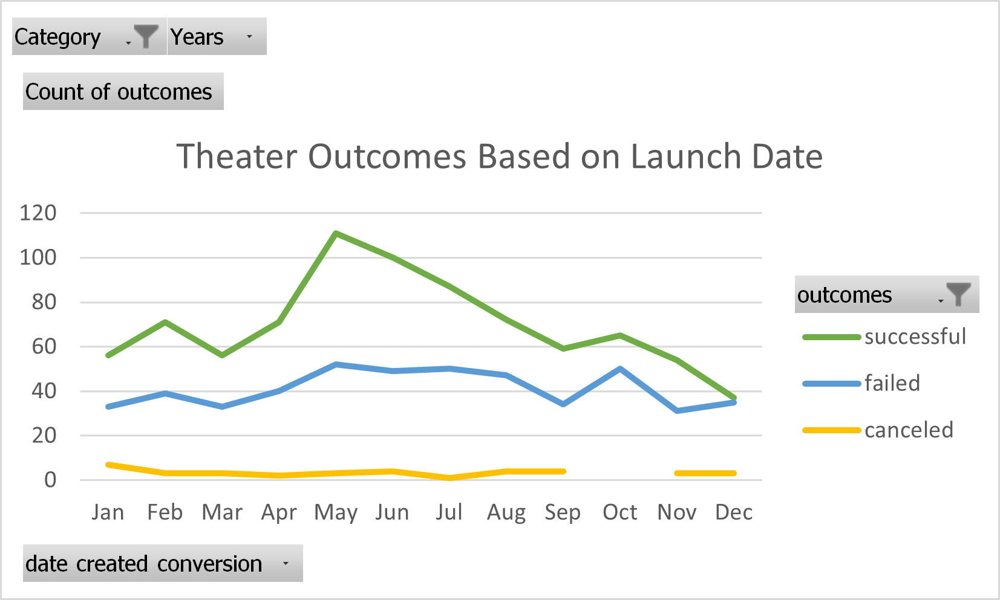
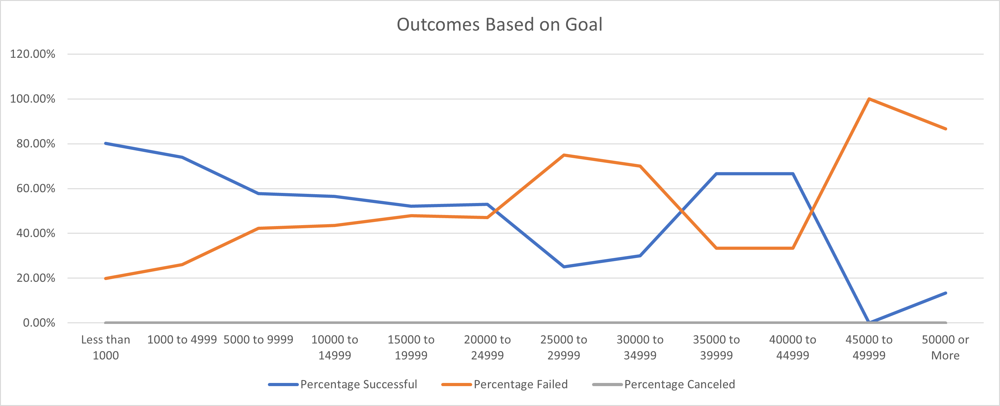

# Kickstarting with Excel

## Overview of Project
This project examined kickstarter data from over 4000 projects launched between 2009 and 2017.  Specifically, we compared the results of theater projects to the month they were launched in and their goal.  We found that May launches lead to the greatest number of successes, and that plays with goals of less than $5000 had a 75% success rate, amounting to 76% of the successful plays.

### Purpose
We undertook this analysis to help a client determine an approach to crowdfunding her first play, by looking for specific factors associated with successful campaigns in the past.  The most controllable factors our data covered are Launch Date and Goal, so those are the elements we focused on.

## Analysis and Challenges

### Analysis of Outcomes Based on Launch Date
The first question we sought to answer was, "When is the best time to launch this kickstarter?"  To do so, we used an Excel pivot table to filter the raw data by Parent Category and Year.  We chose not to use the Year filter at this time, and rather to have a more robust data set to work with.  We did use the Parent Category filter, focusing solely on Theater projects to avoid trends in unrelated fields skewing our results.  The resulting pivot chart is below:

The first detail that catches my eye with this graph is that, regardless of launch month, a majority of theater projects succeed.  Beyond that, there is a clear spike in successful launches in May, followed by a steady decline throughout the summer.  May, June, July, and August have, in descending order, the highest total number of projects.  Looking into the numbers, we see 111 successes out of 166 launches in May, or 66.87%.  As such, May has both the highest total number and the highest percentage of successful launches.

### Analysis of Outcomes Based on Goals

Next we chose to examine how the outcomes varied at different goal levels.  As the Theater category on kickstarter includes both performances and spaces, which can have dramatically different budgets, we further filtered our results based on subcategory, to look exclusively at plays. We divided the goals into 12 boxes: under $1,000, over $50,000, and at $5,000 increments between those extremes.  We used the COUNTIFS() function in Excel to count how many successful, failed, and canceled plays were in each of those boxes, then we used the sums of those counts to get the percentages of each result for each box.  These results are graphed below:

We can see that 80.11% of projects under $1,000 succeeded, as did 73.90% of those between $1,000 and $4,999.  529 of the 694 successful launches fell within those two boxes, which account for 701 of the 1010 total projects.  This means that 76% of the successful plays had goals of less than $5,000.  

### Challenges and Difficulties Encountered

The goal-based analysis provided an interesting challenge in how to efficiently sort the data.  For situations like that, where one wants to look at groups of similar results rather than unique results, a histogram is traditionally the best tool for a job.  However, histograms don't allow as clear of a comparison between different outcomes, and wouldn't work with the percentages we were looking at.  I ended up copying my COUNTIFS() function across the second row, changing the required outcome,and then copying it to each other row and manually changing the goal range. 

## Results

While there is no way to guarantee a crowdfunding campaign is successful, our analysis lends itself to a few recommendations.  From our analysis of outcomes based on launch date, we can see that May has the highest percentage of successful launches, and November and December are the least successful months.  However, even at the end of the year, more theater launches succeed than fail, which is good news for our client!  From our analysis of outcomes based on goals, we see that high goals don't necessarily prevent a successful project, 76% of successful play projects have a goal of under $5,000.  

Our analysis neglected many other factors that are harder to quantify.  We could not look at how a campaign was advertised, how well-known the people involved in a project are, or what genre a play is, to name a few such factors.  Though the data included the end date for each campaign, we did not work with it for this preliminary analysis.  Moving forward, I would want to examine how the duration of a campaign relates to the outcomes at various goal levels.  I would also like to look at the distribution of average donations, most likely in the form of a histogram.  This would help our client set advertising goals, or to adjust their budget based on the number of backers they expect. 
